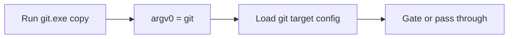

# ClankerGate Practices

## Deny by Default

All commands are denied unless explicitly listed in the `allowed` array. This is a security invariant - the config is a whitelist, never a blacklist. Missing entries are silently blocked with exit code 126.

## PATH Scoping

The release directory must **never** be on the user's permanent PATH. It is prepended only at agent invocation time so interception is scoped to that session:

```bash
# Linux/macOS - scoped to a single command
PATH=~/.local/bin/clankergate-0.0.1:$PATH copilot

# Windows - scoped to child process
cmd /C "set PATH=C:\clankergate-0.0.1;%PATH% && copilot"
```

## argv[0] Dispatch (BusyBox Pattern)

One binary, multiple identities. The binary reads `argv[0]` at runtime to determine which tool it is pretending to be. Symlinks (or copies on Windows) named after gated tools route through ClankerGate transparently.

## Reproduce Through the Gated Name

When verifying gating behavior, invoke the built artifact through the gated target name, not the system tool. On Linux/macOS that usually means the symlink in `zig-out/bin/`; on Windows it means a renamed copy such as `git.exe`.

```powershell
Copy-Item .\zig-out\bin\clankergate.exe .\zig-out\bin\git.exe -Force
& .\zig-out\bin\git.exe --no-pager status
```



## Config Resolution Order

1. `CLANKERGATE_CONFIG` env var is set AND target found AND mode != `default` → use it
2. Otherwise → fall back to `clankergate.json` alongside the binary
3. Target not found in either → error + exit 126

The `default` mode value explicitly opts a target out of a custom config, forcing fallback to the bundled defaults. This lets operators override only some targets without losing coverage on others.

## Longest-Match Subcommand Rules

Rules are matched by the longest prefix of non-flag args. A rule for `"remote add"` takes precedence over `"remote"` when the user types `git remote add`. This allows fine-grained control: permit `git remote` (read) but deny `git remote add` (write).

## Error Messages Instruct the Agent

The POLICY BLOCK message is written to stderr and explicitly tells the AI agent not to retry, investigate, or attempt workarounds. This is intentional - the message is a signal to the agent's reasoning loop, not just a human-readable error. In gated mode, ClankerGate keeps this message attached to exit `126` even when an otherwise-allowed command cannot launch the real executable, so the agent still receives an explicit stop signal instead of a silent `126`.

## Windows: Copy Instead of Symlink

Windows symlinks require administrator privileges or Developer Mode. The release package ships `git.exe` as a plain copy of `clankergate.exe`. Because ClankerGate reads `argv[0]`, the filename is what matters - the copy behaves identically to a symlink.

## Config Healthcheck

Run `clankergate healthcheck` after installing or moving the release directory to verify that `executable` paths in config match actual binary locations on PATH. Use `clankergate healthcheck fix` to auto-update paths in place.

## Zig Version

ClankerGate requires Zig 0.16 exactly. Zig has frequent breaking API changes between versions; do not assume compatibility with other versions.
